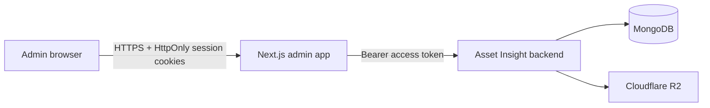

# Asset Insight Admin

The production administration console for Asset Insight. It is a Next.js App Router application used by verified `admin` and `superadmin` accounts to manage reports, users, devices, CRM workflows, and approvals. Its Support page is a private requester experience: an administrator can contact the Asset Insight Developer team and can read only requests owned by the same account.

## Runtime architecture



Browser code calls same-origin route handlers under `/api/admin/*`; backend access and refresh tokens remain in HttpOnly cookies. The support workspace uses `/api/admin/support/*` as a strict, method-and-path allow-listed proxy to the ownership-scoped `/api/support/*` customer API. It does not expose the developer inbox, agent search, internal notes, assignments, priorities, activity, or todo APIs. Image and video bodies stream through the authenticated proxy to the backend, which validates and stores them in R2 before returning a renderable attachment.

## Environment

Create `.env.local` for local development or configure the same value in the production process environment:

```env
# Backend origin only; do not append /api.
NEXT_PUBLIC_SERVER_URL=http://127.0.0.1:4000

# Optional provider credentials used by existing image tooling.
HITPAW_API_KEY=
PICSART_API_KEY=
```

Never commit real credentials. The admin application does not need MongoDB or R2 credentials; those remain in the authenticated backend.

## Commands

```bash
npm ci
npm run dev
npm run lint
npx tsc --noEmit
npm run build
npm start
```

The support feature should be checked at desktop, tablet, portrait mobile, and landscape mobile widths. Only the request list and message timeline are intended to scroll; the document and reply composer remain fixed to the viewport.

## Production deployment

Production runs as the `assetinsight-admin` PM2 application from `ecosystem.config.cjs`, normally as two cluster workers on port `3001` behind Nginx.

```bash
npm run deploy
```

The deploy command fast-forwards `main`, installs the lockfile exactly, builds Next.js, reloads only `assetinsight-admin`, and saves PM2 state. Run it from the production admin checkout after the intended commit is available on `origin/main`.

Post-deploy checks:

```bash
pm2 status assetinsight-admin
curl --fail --head http://127.0.0.1:3001/login
curl --fail --head https://admin.assetinsightvaluator.com/login
```

Then verify that the signed-in administrator sees only their own requests, can create a request, can retry a reply without duplication, and can upload and render one image and one video. Confirm that developer-only support routes remain unavailable through the admin proxy. Do not expose port `3001` publicly; Nginx is the public TLS boundary.

For support media, install the location in `ops/nginx/support-upload-location.conf` inside the admin HTTPS server block. It disables request buffering only for the authenticated raw-upload route and aligns the proxy timeout with the 15-minute application limit. Always run `nginx -t` before a graceful reload.

## Support workflow invariants

- Every support read or mutation is authorized by the backend's ownership-scoped customer support middleware and the authenticated User ID.
- A known conversation ID owned by another account must still return `404`.
- Internal developer notes are never returned by the customer message API.
- A stable `clientMessageId` is reused only while retrying the same logical reply.
- Attachments are not rendered or claimable until the backend verifies them as `ready`.
- Uploads use the server-mediated streaming endpoint; browser R2 credentials and bucket CORS are not required.
- New-request media is attached only after the initial request creates a conversation ID. A partial media failure must keep that request selected instead of creating a duplicate.
- Developer queue access is a separate backend capability and is not implied by `admin` or `superadmin` role membership.
- Public media URLs are bearer-like references and must not be written to application logs.
