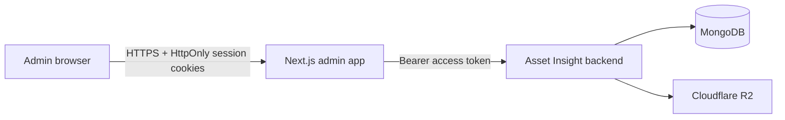

# Asset Insight Admin

The production administration console for Asset Insight. It is a Next.js App Router application used by verified `admin` and `superadmin` accounts to manage reports, users, devices, CRM workflows, and approvals. Its Support page is a private requester experience: an administrator can contact the Asset Insight Developer team and can read only requests owned by the same account.

## Runtime architecture

### Report Activity

`/report-activity` provides a searchable Asset/Lot Listing activity table and a
paginated timeline for admin and superadmin. Search by user name/email and
contract, then apply source/type/action/outcome/UTC-date filters. Counts, camera
stamping, upload-logo selections, receipt verification, source/destination,
errors and permitted field comparisons remain separate facts. Missing historical
evidence is labelled Not recorded; older records show a current-state baseline.

The Captures tab reuses Offline Captures; `/offline-captures` redirects to
`/report-activity?tab=captures`. All reads and removal go through the same-origin
HttpOnly BFF. Operational visibility does not grant preview/field-value access.
Deleted-report values are superadmin-only, and deleted preview links are disabled.
Superadmin removal requires confirmation plus the reviewed revision and removes
only history, not reports/photos. A server tombstone rejects delayed restoration.

Filters are explicitly applied, requests are abort-fenced, previous results are
labelled when a refresh fails, and last-refresh/receipt/device times are distinct.
Deploy the backend ledger before this admin build. See the backend
`docs/report-activity.md` for audit/privacy boundaries and release gates.

Verification: `npm run verify`, `node --test tests/*.test.mjs`; isolated local
Chromium checks cover 320/390/768/1440px, light/dark, timeline expansion, filters,
deleted/baseline/error states, keyboard controls and axe accessibility. No live
reports or production endpoints are needed for these fixtures.



Browser code calls same-origin route handlers under `/api/admin/*`; backend access and refresh tokens remain in HttpOnly cookies. The support workspace uses `/api/admin/support/*` as a strict, method-and-path allow-listed proxy to the ownership-scoped `/api/support/*` customer API. It does not expose the developer inbox, agent search, internal notes, assignments, priorities, activity, or todo APIs. Image and video bodies stream through the authenticated proxy to the backend, which validates and stores them in R2 before returning a renderable attachment.

## Environment

Create `.env.local` for local development or configure the same value in the production process environment:

```env
# Backend origin only; do not append /api.
NEXT_PUBLIC_SERVER_URL=http://127.0.0.1:4000

# Optional provider credentials used by existing image tooling.
HITPAW_API_KEY=
PICSART_API_KEY=
```

Never commit real credentials. The admin application does not need MongoDB or R2 credentials; those remain in the authenticated backend.

## Commands

Use Node.js 22 through 26 with npm 10 or 11. The local compatibility gate is
verified with Node.js 26.7 and npm 11.

```bash
npm ci
npm run dev
npm run lint
npx tsc --noEmit
npm run build
npm start
```

The support feature should be checked at desktop, tablet, portrait mobile, and landscape mobile widths. Only the request list and message timeline are intended to scroll; the document and reply composer remain fixed to the viewport.

## Dashboard overview

The superadmin-only `/dashboard` uses the existing same-origin desktop-dashboard
snapshot. Its compact metric band leads into one lazy-loaded Chart.js activity
plot, directly labelled report-type bars, independent current-workflow bars,
recent reports and the existing credit/settings controls. The `/stats` workspace,
navigation, authorization and HttpOnly BFF are unchanged.

Reports/lots/activity/types follow the applied inclusive UTC date range. Registered
users and Pending / Approved counts are all-time; the historical `kpis.released`
wire key counts approved reports, not actual releases. Queue and recent reports
also use all dates. Salvage activity uses grouped generated-file creation dates,
not canonical parent creation or completed throughput. The visible source note
retains this limitation. See backend `docs/architecture/runtime-flows.md` for exact
eligibility, archive and timezone scopes. Deploy its matching Salvage activity
predicate fix with this interface so daily and type/KPI sources agree.

Date edits are staged: Cancel discards them and Apply issues one request. A
superseded request cannot replace a newer snapshot. Refresh, timeout, malformed
payload and network errors retain the last successful data with its time and
range; unavailable fields are not converted to zero. Manual refresh is the update
model, not a live stream. The selected range is page-local and resets on a new
visit. The chart has a keyboard/touch Data view; long ranges use at most 180
contiguous date bins with unchanged totals and explicit missing intervals.
This bounds browser rendering only; the backend still returns daily data across
the requested range. Chart animation is disabled and the two small bar lists
are DOM elements, not additional chart instances.

Workflow counts are not a funnel. Drill-down explains that the sample contains
up to 60 recently updated queue items; filtered Stats remains the full-detail
path. Ready today uses Regina time and the release or last-update date. Recent
reports preserve up to eight records, with a scrollable desktop table and wrapping
mobile rows. An inherited legacy release flag never turns a draft, preview,
processing or pending report into a Released badge.

Settings load on first open, handle independent failures, and cannot save unloaded
defaults. Credit loading/retry is GET; only explicit Sync uses the existing POST.
Low-balance warnings, operational source warnings and server balances are retained
without multiplier formulas. The two technical model/token-pricing notices are
hidden in the credit UI only; backend accounting, warnings and multiplier remain
unchanged. Suppression also handles both notices in one warning, repeated notices
and wrapped whitespace, while preserving any operational warning in that same
entry. This applies to the displayed alert and its tooltip after both loading and
Sync. Rebuild/redeploy the admin application to update an existing production UI;
restarting the backend alone cannot update the browser bundle. No additional
dependencies or API/schema changes are needed.

Verification: `npm run verify` and `node --test tests/*.test.mjs`. Dashboard-focused
data/status/date/payload cases live in `tests/dashboard-data.test.mjs` and
`tests/dashboard-payload.test.mjs`. Use isolated upstream fixtures to check date
Apply/Cancel, stale-response ordering, failures, Chart/Data parity, settings,
credits and queue focus restoration at desktop/tablet/mobile sizes; do not use
production settings mutations as a visual test.

2026-09-14 acceptance: admin verify and 47 policy/data tests passed; the paired
backend verify passed 1,764 tests plus the report-workflow check. Isolated
production-build Chromium checks covered date Apply/Cancel, Chart/Data totals,
queue focus, lazy settings, explicit credit Sync, failed/forbidden/malformed
responses, delayed-request ordering and 175-bin long-range totals. Responsive
checks covered 320, 390, 480, 768, 844, 1200 and 1536 px widths. Tested light/dark
dashboard and focused dialogs had zero axe violations. The approved desktop and
mobile concepts were compared with final screenshots; real navigation, full
eight-record metadata and accessible touch targets intentionally remain intact.
No production data/settings, new packages, push or deployment were involved;
Safari/Firefox and production-scale response latency remain unverified.

## Report approvals

Both `admin` and `superadmin` can open Pending Approvals. Ordinary `user` accounts remain limited to their permitted reports; the backend authorizes every decision. Pending rows group sibling files by parent report, but review/approve/return actions use the actual row/artifact ID.

Real Estate and Salvage use **Approve & release**: successful approval publishes their complete current files without a second release step. Asset approval/release behavior is unchanged. Older already-approved Real Estate/Salvage reports that still have a pending release retain a **Legacy release** action; the UI never invents download readiness or rewrites existing records.

Processing/incomplete file sets cannot be approved. Approval errors remain visible and retain the row for review/retry. Pending/approve/return requests use the shared HttpOnly-cookie BFF, refreshing only on `401` and preserving genuine `403`/`409` responses. Focused policy tests: `node --test tests/report-approval-ui-policy.test.mjs`.

Canadian Salvage assessment v2 approval loads the current report revision before
showing mandatory evidence-limit acknowledgements and a review note. The BFF
forwards only `{salvageReviewAcknowledgement: {baseRevision, limitationCodes,
note}}`; the backend supplies reviewer identity/time and records the audit against
the approved artifact generation, not as a signature in existing files. A `409`
clears the checked limitations and note and requires a manual reload/re-review;
it never retries approval automatically. Legacy Salvage and other report families
retain their existing decisions. No new role or separate release step is added.

Salvage report data uses optional backend-built `report_enrichment` v1 for a read-only, localized executive summary, assignment/condition context, repair provenance, comparable verification, calculations, evidence/photo index, review checklist, revision history and references. Responsive tables display saved strings only. Generic nested assessment/context duplicates are omitted when this projection is present; the complete snapshot remains available in Raw JSON. The existing HttpOnly BFF, current-revision acknowledgement and approval controls remain unchanged.

## Saved Asset/Lot preview recovery

Preview Reports provides **Resubmit preview** for eligible saved Asset and Lot
Listing previews. The backend supplies eligibility, an explanation when blocked,
and an opaque revision bound to the loaded data. Confirming rebuilds files from
that saved preview on the same report, without new analysis. Asset approval and
release rules remain unchanged; Lot Listings approve/release only after successful
file publication. Draft Preview drawers remain read-only.

The browser sends only `{baseRevision}` through the dedicated same-origin,
HttpOnly-cookie BFF. The request is limited to 2 KiB even for chunked bodies;
caller-supplied report data and actor fields are never forwarded. Backend role,
revision, workflow and media checks remain authoritative. Duplicate clicks are
blocked, acceptance closes the drawer and refreshes the queue, and a `409` or
uncertain response requires **Reload and review**, never automatic resubmission.
Older backend responses without eligibility/revision disable this action; deploy
backend support first. This feature does not repair missing uploads or duplicate
stored files. Focused checks: `node --test tests/preview-resubmit-request.test.mjs`.

Reassignment also supports submitted Asset/Lot previews whose file generation
failed, when the backend reports `transferEligible`. `transferRequiresReview`
adds an explicit warning: ownership moves on the same report with saved data and
the failure diagnostic retained; no files are queued. The receiving user reviews
and explicitly resubmits from Previews. Ready/unsubmitted previews are never
automatically submitted. Active generation and successful reports remain blocked.
Transfer confirmation closes stale owner/revision details and refreshes the list;
conflicts, timeouts and uncertain responses require manual reload/review without
automatic replay. The existing superadmin Preview Reports boundary is unchanged.

## Reviewed preview-owner notifications

Preview Reports provides **Notify** from each list row/card and the detail drawer.
Both open one email-style composer. A side-effect-free reminder GET loads the
current owner, report correction details, affected lots, suggested steps and
subject/body from the backend. The recipient is read-only; administrators review
and edit the plain-text subject/message before explicitly sending email plus an
in-app notification. Opening the composer does not send anything or alter reports.
Notify remains available when a new send is blocked: the current draft explains
the reason and disables Send, while an existing delivery can still be checked.

POST forwards only `subject`, `message`, `baseRevision` and a stable UUID
`requestId` through the HttpOnly BFF. Same-origin, JSON and streamed 64 KiB limits
protect this mutation. The backend validates current ownership/state; a 409
requires reload/review. Pending or uncertain delivery freezes its original
recipient/text/revision/request ID, including after reopening. **Check delivery**
reuses that request without asking the email provider to send again. No automatic
email retries or fresh IDs are created after an uncertain response. Confirmed
delivery and accepted processing refresh the list with accurate status feedback.
The existing superadmin boundary is unchanged; deploy backend support first.
Policy checks: `node --test tests/preview-reminder-request.test.mjs`.

## Offline capture inventory

`/offline-captures` is available to **admin and superadmin**. It displays only
the device metadata last synchronized to the backend: creator, contract, report
type, device status, lot/photo counts and device-clock capture/save times.
Filters are applied explicitly; user lookup, list rows and per-lot details are
bounded and paginated. **Last synchronized** date filters use inclusive UTC days
against the server receipt time, not the untrusted device clock.

Device counts are not proof of an uploaded photo or a cloud backup. Offline
devices may have newer changes; captures never synchronized cannot appear here.
The detail dialog separates device-reported inventory from server-confirmed
upload counts, acceptance, preview submission, processing and file generation.
Unknown uploaded counts remain **Not confirmed**, distinct from zero. **Files
generated** does not grant approval, release or download access. Existing Preview
Reports permissions remain unchanged; a linked report ID is informational only.
There are no photo URLs, device paths, private form notes or media previews.

Browser requests stay on the HttpOnly BFF:

- `GET /api/admin/capture-inventory/users?search=&limit=`
- `GET /api/admin/capture-inventory?userId=&search=&reportType=&localStatus=&receivedFrom=&receivedTo=&page=&limit=`
- `GET /api/admin/capture-inventory/:id?lotsPage=&lotsLimit=`
- `DELETE /api/admin/capture-inventory/:id` with the exact loaded `{revision}`.

Capture ledger `:id` is the backend's 64-character SHA-256 identity. It is distinct
from the device capture UUID and the 24-character Mongo user/report IDs; user
filters keep their existing Mongo ID validation.

The final action is offered **only for discarded device history**, after explicit
confirmation. It tombstones metadata; it never deletes device photos, uploaded
objects, drafts or reports. The proxy enforces same-origin JSON, a streamed 1 KiB
body bound and revision-only input; the backend freshly verifies role, state and
revision. A conflict or uncertain response requires reload and review, never an
automatic replay. Reads are no-store and abort-fenced. A failed refresh retains
the last valid snapshot with a warning, rather than turning invalid data into
zero counts. Deploy backend inventory support before enabling this admin build.

Focused policies: `node --test tests/capture-inventory.test.mjs`.

Verification (2026-09-17): admin verification/build and 70 policy tests passed.
An isolated mock backend and the production Next build passed Chromium checks
with actual backend-style owner/UUID SHA-256 capture identities
at 1440px in light/dark, 768px, 390px and 320px, including list/lot pagination,
staged filters, failed/malformed refreshes, roles, BFF origin/size/allowlist gates,
out-of-order reads, revision conflicts and uncertain removal. Page/detail axe
checks found no remaining violations, and no browser bearer headers, external
requests or production runtime console errors were observed. Browser plugin was
unavailable, so the existing sibling Playwright installation was used. Safari,
Firefox, real-device interaction and production latency remain unverified. MUI
7.3.11 emits an internal Autocomplete key warning only in development; no package
changes were introduced. No production data, files or deployments were touched.

## Production deployment

Production runs as the `assetinsight-admin` PM2 application from `ecosystem.config.cjs`, normally as two cluster workers on port `3001` behind Nginx.

```bash
npm run deploy
```

The deploy command fast-forwards `main`, installs the lockfile exactly, builds Next.js, reloads only `assetinsight-admin`, and saves PM2 state. Run it from the production admin checkout after the intended commit is available on `origin/main`.

Post-deploy checks:

```bash
pm2 status assetinsight-admin
curl --fail --head http://127.0.0.1:3001/login
curl --fail --head https://admin.assetinsightvaluator.com/login
```

Then verify that the signed-in administrator sees only their own requests, can create a request, can retry a reply without duplication, and can upload and render one image and one video. Confirm that developer-only support routes remain unavailable through the admin proxy. Do not expose port `3001` publicly; Nginx is the public TLS boundary.

For support media, install the location in `ops/nginx/support-upload-location.conf` inside the admin HTTPS server block. It disables request buffering only for the authenticated raw-upload route and aligns the proxy timeout with the 15-minute application limit. Always run `nginx -t` before a graceful reload.

## Support workflow invariants

- Every support read or mutation is authorized by the backend's ownership-scoped customer support middleware and the authenticated User ID.
- A known conversation ID owned by another account must still return `404`.
- Internal developer notes are never returned by the customer message API.
- A stable `clientMessageId` is reused only while retrying the same logical reply.
- Attachments are not rendered or claimable until the backend verifies them as `ready`.
- Uploads use the server-mediated streaming endpoint; browser R2 credentials and bucket CORS are not required.
- New-request media is attached only after the initial request creates a conversation ID. A partial media failure must keep that request selected instead of creating a duplicate.
- Developer queue access is a separate backend capability and is not implied by `admin` or `superadmin` role membership.
- Public media URLs are bearer-like references and must not be written to application logs.
